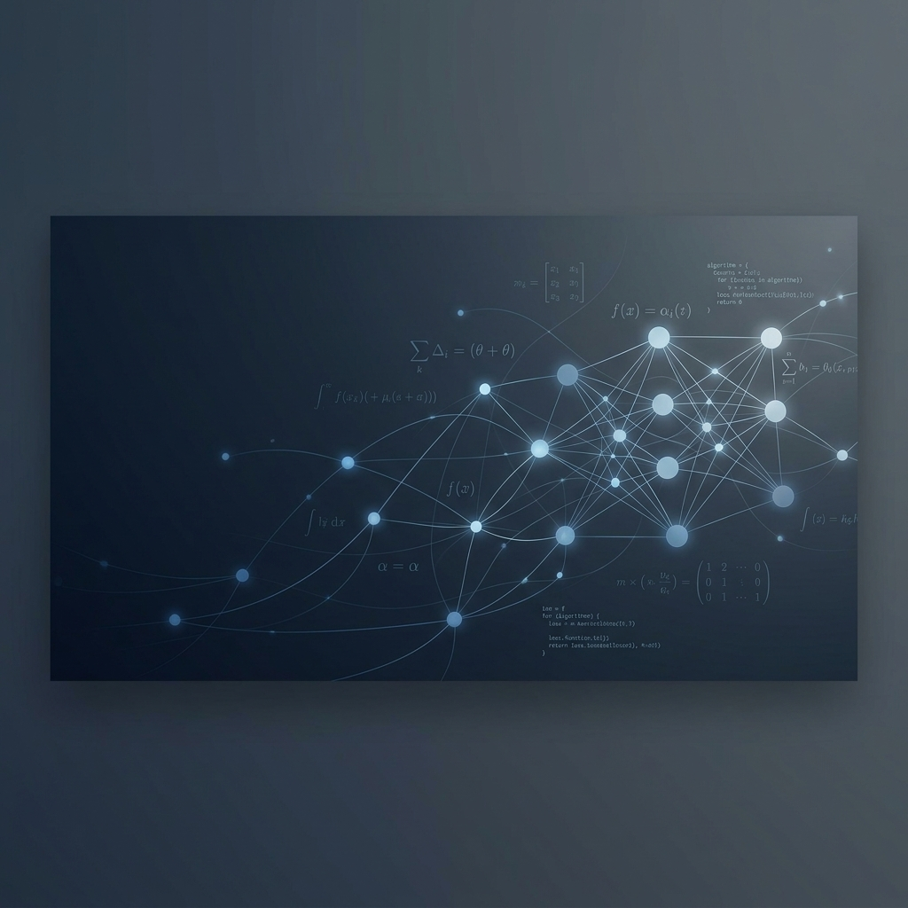

# <!-- placeholder:name -->Orion Arch<!-- end-placeholder -->

  
  <!-- Banner -->
  

  <!-- Title & Subtitle -->
  <h1>👋 Hi, I'm <!-- placeholder:name -->Orion Arch<!-- end-placeholder --></h1>
  
<strong><!-- placeholder:tagline -->AI / ML Enthusiast & Aspiring Data Scientist exploring Large Language Models and Computer Vision<!-- end-placeholder --></strong>

  
🏫 <!-- placeholder:institution -->AI & Data Science Student / Explorer<!-- end-placeholder -->

  <!-- Badges -->
  

    <a href="https://scholar.google.com/citations?user=<!-- placeholder:scholar -->orion_scholar_id<!-- end-placeholder -->" target="_blank">
      
    </a>
    <a href="https://orcid.org/<!-- placeholder:orcid -->0000-0002-1825-0097<!-- end-placeholder -->" target="_blank">
      
    </a>
    <a href="https://linkedin.com/in/<!-- placeholder:linkedin -->orionarch<!-- end-placeholder -->" target="_blank">
      
    </a>
    <a href="mailto:<!-- placeholder:email -->meiqilin062@gmail.com<!-- end-placeholder -->">
      
    </a>
    <a href="https://huggingface.co/<!-- placeholder:huggingface -->orionarch<!-- end-placeholder -->" target="_blank">
      
    </a>
  

---

## 📖 About Me
<!-- placeholder:about_me -->I am a passionate learner and developer diving deep into Artificial Intelligence, Machine Learning, and Data Science. I am highly interested in understanding how modern architectures like transformers function and how they can be optimized for real-world applications. Currently, I am building my foundation by studying core ML algorithms, building small-scale models, and participating in open-source projects. My goal is to work on impactful projects that solve practical challenges using data.<!-- end-placeholder -->

### 🎯 Areas of Exploration
- <!-- placeholder:research_point_1 -->🤖 **Generative AI & LLMs**: Understanding parameter-efficient fine-tuning (PEFT) and retrieval-augmented generation (RAG) workflows.<!-- end-placeholder -->
- <!-- placeholder:research_point_2 -->👁️ **Computer Vision**: Learning self-supervised visual representation and convolutional/attention-based vision models.<!-- end-placeholder -->
- <!-- placeholder:research_point_3 -->🧬 **AI for Science & Data Analysis**: Exploring the application of machine learning algorithms to tabular data, scientific computing, and genomics.<!-- end-placeholder -->

---

## 🛠️ Core Tech Stack & Tools

<table>
  <tr>
    <td width="30%"><strong>Languages & Acceleration</strong></td>
    <td>
      
      
      
      
    </td>
  </tr>
  <tr>
    <td><strong>ML & DL Frameworks</strong></td>
    <td>
      
      
      
      
    </td>
  </tr>
  <tr>
    <td><strong>GenAI & LLM Tools</strong></td>
    <td>
      
      
      
    </td>
  </tr>
  <tr>
    <td><strong>Data Science & Science</strong></td>
    <td>
      
      
      
      
    </td>
  </tr>
  <tr>
    <td><strong>MLOps & Deployment</strong></td>
    <td>
      
      
      
      
      
      
      
    </td>
  </tr>
</table>

---

## 📈 GitHub Statistics

  <table border="0">
    <tr>
      <td width="50%" align="center">
        OrionArch<!-- end-placeholder -->&show_icons=true&theme=default&title_color=2c3e50&icon_color=4a5568&text_color=4a5568&bg_color=f8f9fa&hide_border=false&border_color=e2e8f0" alt="GitHub Stats" width="95%" />
      </td>
      <td width="50%" align="center">
        OrionArch<!-- end-placeholder -->&layout=compact&title_color=2c3e50&icon_color=4a5568&text_color=4a5568&bg_color=f8f9fa&hide_border=false&border_color=e2e8f0" alt="Top Languages" width="95%" />
      </td>
    </tr>
  </table>

---

## 💬 Connect & Collaborate

  
  📬 Feel free to reach out for collaborations, research discussions, or just to say hello!
  
  
  
  
  

  <!-- Visitor Counter Widget -->
  OrionArch<!-- end-placeholder -->/count.svg" alt="Visitor Counter" />

